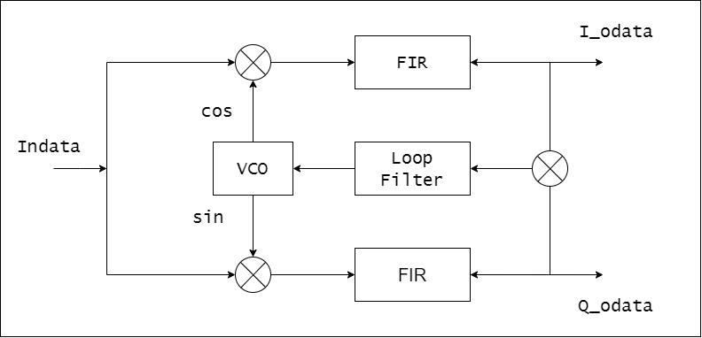
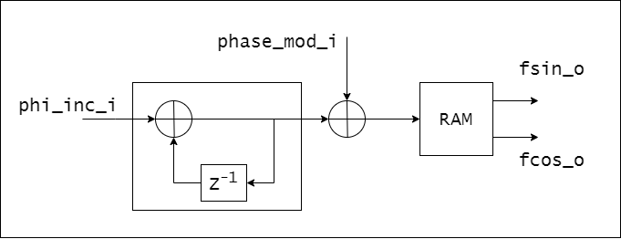

# Восстановление несущей по схеме Костаса
## Структурная схема

Схема состоит из:

+ NCO (Numerically-controlled oscillator);
+ FIR;
+ Loop Filter.

Все рассчеты в этой схеме проводились для ***clk_main*** = 100 МГц.

### NCO

Вход ***phi_inc_i*** является шагом инкремента для аккумулятора фазы - которая определяет частоту ***f0*** генерации синуса и косинуса.  ***phi_inc_i*** = 2^32*f0/clk.
Вход ***phase_mod_i***  сдвигает фазу NCO - управляется выходом петлевого фильтра. 
Для генерации сигналов используются 65536 16 битных отсчетов одного периода гармонического сигнала, который хранится в блочной памяти ( для экономии ресурсов памяти можно хранить четверть периода и манипулировать знаком отсчетов и инкремента аккумулятора фазы).

### FIR

Оконный КИХ ФНЧ Блэкмана 128 порядка с частотой среза 5 МГц и 16 битными коэффициентами в формате фиксированной точки. Модуль взят из репозитория [fir][fir].

### Loop Filter

Коэффициенты Kp и Ki для петлевого фильтра рассчитывались из уравнений (21) в статье [Цифровой контур ФАПЧ][dpll]. Демпинг фактор равен 0,707. Резонансная частота равна 2*pi*1e6. В модуле есть параметры окна захвата по уровню ***LOCKWIND*** и по количеству тактов ***LOCKNUM***. Абсолютное значение конечной разности первого порядка одной из квадратур сравнивается с  ***LOCKWIND*** и это значение меньше, то подтверждается сигнал ***locked***. ***locked_o*** подтверждается, если в течении ***LOCKNUM*** тактов был захват.

## Тестирование

Тестирование проводилось в Vivado 2020.1. Значение ***phi_inc_i*** = 0x26666666, что соответствует частоте freq = 15.0 МГц. Проверялось восстановление несущей при скачкообразном изменении фазы и частоты подаваемого на схему сигнала. Амплитуда сигнала не менялась. 

## Результаты

Результаты симуляции показали, что для этой схемы с приведенными параметрами осуществляется восстановление несущей при любом скачке фазы для сигнала с полосой, согласованной с полосой ФНЧ. Срыв слежения происходит при изменении частоты сигнала относительно опорной частоты гетеродина больше чем на 60кГц. Максимальное время восстановления несущей в симуляции = 17 мкс, а максимальное отклонение частоты = +/- 60кГц. Что не подтверждается теоритичекими рассчетами в формулах (28) и (29) в  статье [ФАПЧ][pll]. Почему так, пока объяснить не могу.

 [fir]:     https://github.com/PincerBeetle/fir
 [dpll]:    http://www.dsplib.ru/content/dpll/dpll.html 
 [pll]:     http://www.dsplib.ru/content/pll/pll.html 

